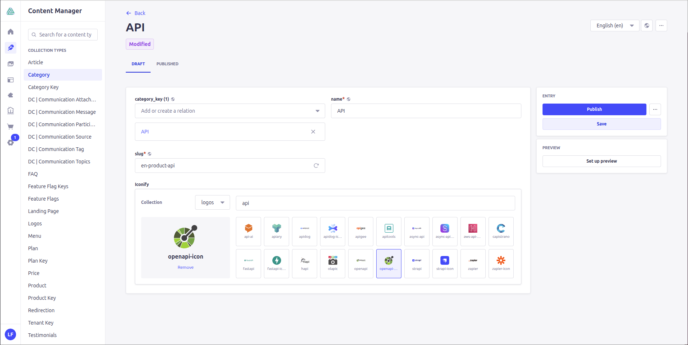
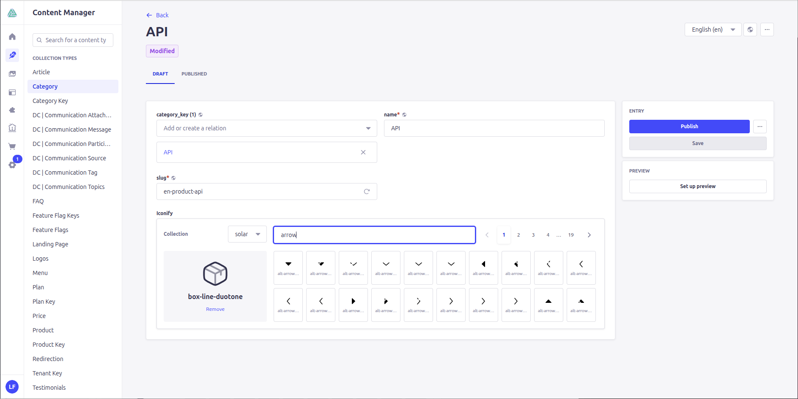

# Strapi Iconify Picker

**Design at the speed of thought.**

Unlock the power of 150,000+ icons within your Strapi content workflow. Effortless search. Instant previews. uncompromising performance.

[](https://strapi.io)
[](https://www.typescriptlang.org)
[](LICENSE)

## The Experience

We built the Iconify Picker to be invisible. It steps out of your way, letting your creativity flow.

* **Infinite Canvas**: Access every major icon set—Material, Lucide, Phosphor, Solar, and more.
* **Instant Clarity**: Large, sharp previews ensuring you pick the perfect asset every time.
* **Absolute Control**: Admins curate the available sets, ensuring brand harmony.
* **The Power of 'None'**: A dedicated removal workflow makes refining your selection as easy as making one.
* **Featherlight Architecture**: Structured JSON storage keeps your database clean and your frontend fast.



## Quick Start

### 1. Install

<details>
<summary>Click to view installation commands</summary>

```bash
yarn add @sunny-pirate/strapi-plugin-iconify-picker
# or
npm install @sunny-pirate/strapi-plugin-iconify-picker
```

</details>

### 2. Configure

Add to your `config/plugins.ts`:

```typescript
export default ({ env }: { env: any }) => ({
  '@sunny-pirate/strapi-plugin-iconify-picker': {
    enabled: true,
    config: {
      collections: env.array('DLS_ICON_COLLECTIONS', ['solar', 'logos', 'flag', 'lucide'])
    },
  },
});
```

### 3. Build

<details>
<summary>Click to view build commands</summary>

```bash
yarn build && yarn develop
# or
npm run build && npm run develop
```

</details>

## Governance & Configuration

Precision starts at the foundation. Control which collections are available to your team through environment variables or direct configuration.

### Environment Variables

| Variable | Description | Default |
| :--- | :--- | :--- |
| `DLS_ICON_COLLECTIONS` | Comma-separated list of Iconify prefixes | `solar,logos,flag,lucide` |

## Usage

Designed for focus. The interface puts your content first.

### Visual Workflow

| 🔍 **Search Experience** | 👁️ **Final Selection** |
| :--- | :--- |
|  |  |

| ⚙️ **Governance & Control** |
| :--- |
|  |

1. **Selection**: Select from curated collections tailored to your brand.
2. **Discovery**: High-performance search helps you find the perfect icon in seconds.
3. **Preview**: Instant visual feedback ensures your selection matches your design.
4. **Refinement**: One-click removal keeps your workflow clean and decisive.

## Architecture

Built with performance and scalability in mind.

### Data Model

We store data in a clean, portable JSON format:

```json
{
  "prefix": "solar",
  "icon": "box-bold",
  "value": "solar:box-bold"
}
```

For detailed architectural diagrams (Class, Sequence, ER), please refer to the [Technical Documentation](docs/modules/ROOT/pages/iconify-picker.adoc).

## License

MIT License
