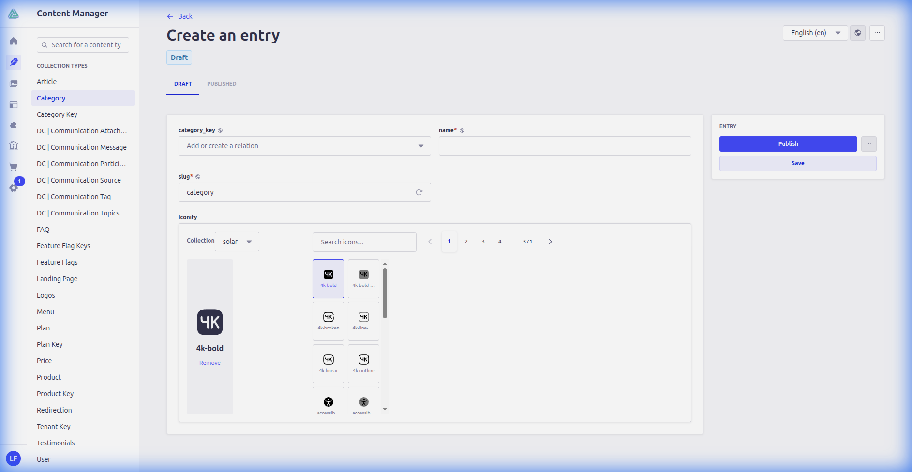

# Strapi Iconify Picker



**Design at the speed of thought.**

Unlock the power of 150,000+ icons within your Strapi content workflow. Effortless search. Instant previews. uncompromising performance.

[](https://strapi.io)
[](https://www.typescriptlang.org)
[](LICENSE)

## The Experience

We built the Iconify Picker to be invisible. It steps out of your way, letting your creativity flow.

* **Infinite Canvas**: Access every major icon set—Material, Lucide, Phosphor, Solar, and more.
* **Instant Clarity**: Large, sharp previews ensuring you pick the perfect asset every time.
* **Precision Control**: Admins curate the available sets, ensuring brand consistency across the board.
* **Featherlight**: Stores a minimal JSON object. No bloating your database with raw SVG data.

## Quick Start

### 1. Install

```bash
npm install dls-iconify-picker
```

### 2. Configure

Add to your `config/plugins.ts`:

```typescript
export default () => ({
  'dls-iconify-picker': {
    enabled: true,
  },
});
```

### 3. Build

```bash
npm run build && npm run develop
```

## Usage

Designed for focus. The interface puts your content first.

1. **Select**: Choose a collection from the dropdown.
2. **Search**: Find your icon instantly.
3. **Pick**: Click to select. The preview confirms your choice.


## Architecture

Built with performance and scalability in mind.

### Data Model

We store data in a clean, portable JSON format:

```json
{
  "prefix": "solar",
  "icon": "box-bold",
  "value": "solar:box-bold"
}
```

For detailed architectural diagrams (Class, Sequence, ER), please refer to the [Technical Documentation](docs/modules/ROOT/pages/iconify-picker.adoc).

## License

MIT License
